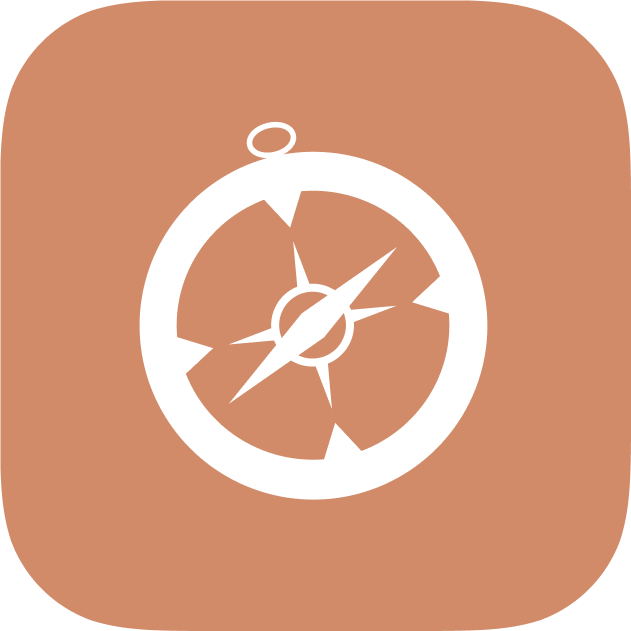
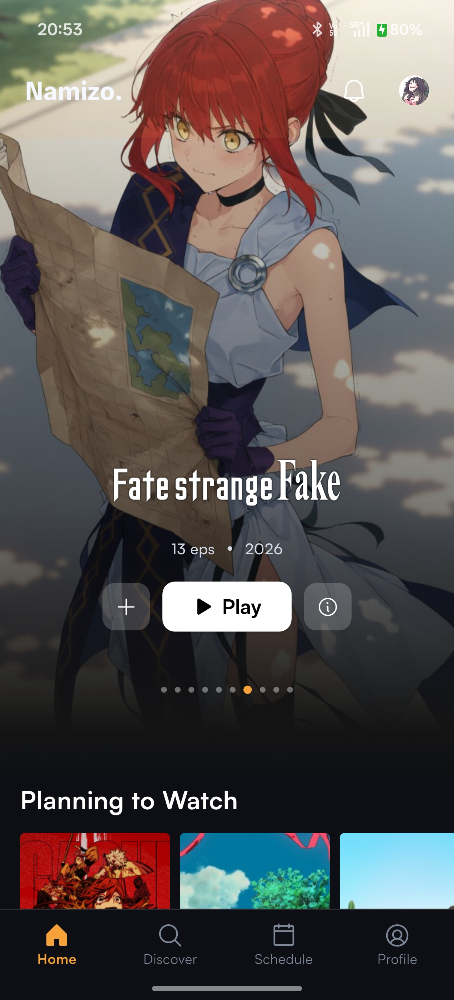
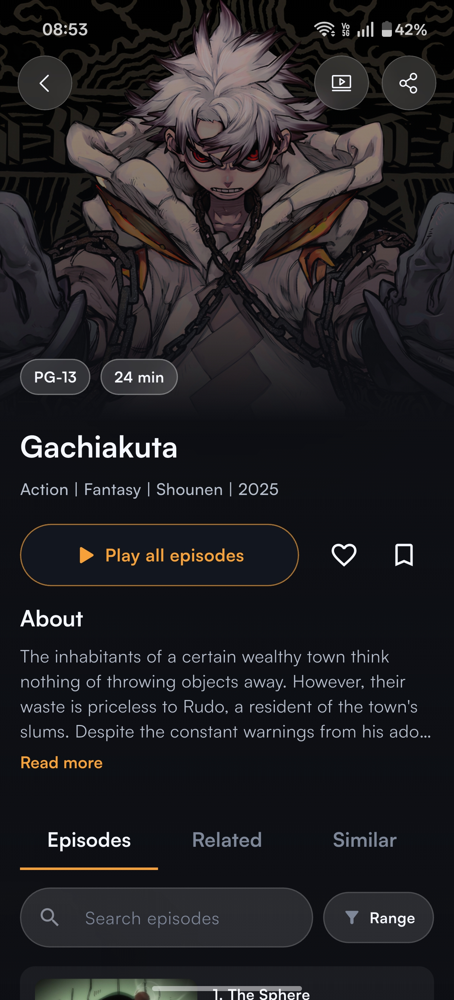
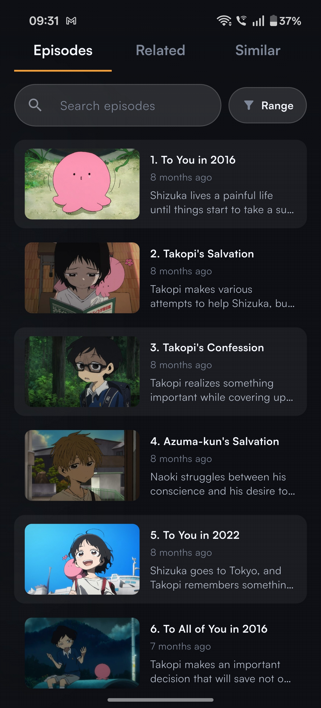
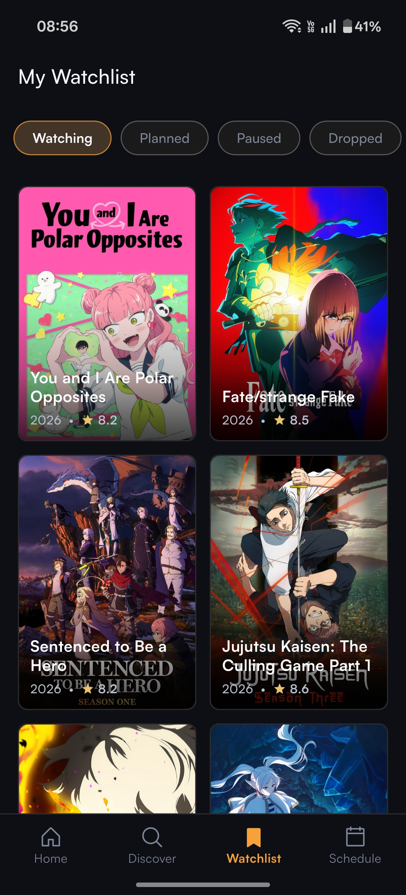
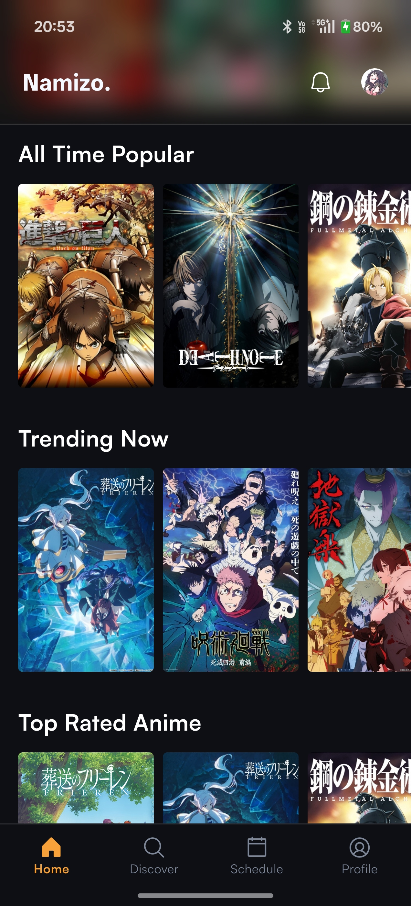
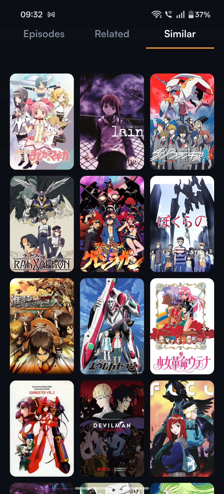
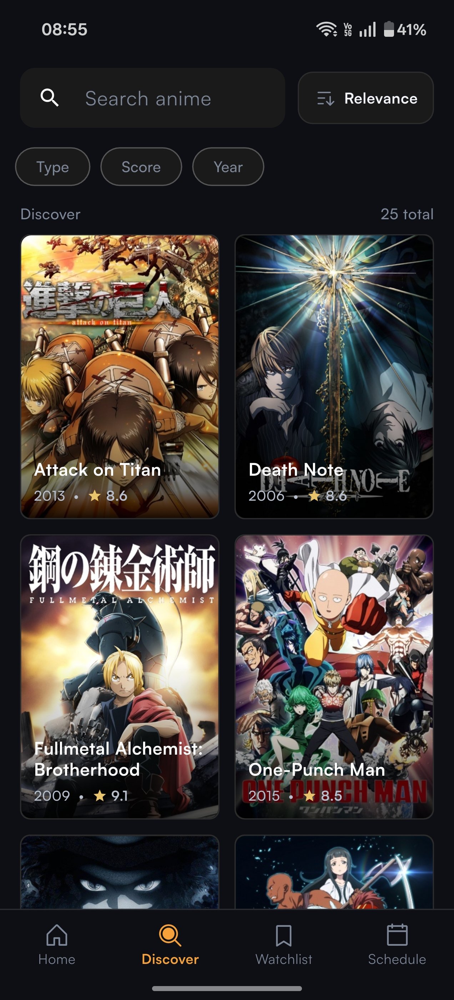
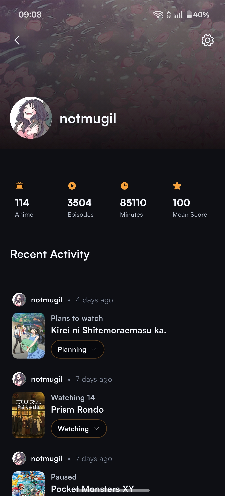

    

        
    

    <h1>
        namizo
    </h1>
    
<i>just one more episode.</i>

 ⠀

## Table of Contents
- [Features](#features)
- [Screenshots](#screenshots)
- [Contributing](#contributing)
- [Disclaimer](#disclaimer)
- [License](#license)

## Features
- **Curated Home Feed** — Browse featured picks and customizable content rows.
- **Detailed Anime Pages** — View synopsis, trailer, episodes, related titles, and similar picks.
- **Smart Search & Filters** — Find anime quickly with sorting and filtering options.
- **Continue Watching** — Resume from where you left off with saved playback history.
- **Organized Watchlist** — Manage titles by status: Watching, Planning, Paused, Dropped, and Completed.
- **Episode & Update Alerts** — Get notified about new episodes and app updates.
- **Weekly Schedule** — Track upcoming episodes, including tracked-only viewing mode.
- **AniList Sync** — Connect AniList to sync watchlist/progress and view profile stats/activity.

## Screenshots

<table>
<tr>
<td align="center" width="25%">

 <b>Home</b>
</td>
<td align="center" width="25%">

 <b>Details</b>
</td>
<td align="center" width="25%">

 <b>Episodes</b>
</td>
<td align="center" width="25%">

 <b>Watchlist</b>
</td>
</tr>
<tr>
<td align="center" width="25%">

 <b>Feed</b>
</td>
<td align="center" width="25%">

 <b>Similar Anime</b>
</td>
<td align="center" width="25%">

 <b>Search</b>
</td>
<td align="center" width="25%">

 <b>Profile</b>
</td>
</tr>
</table>

## Contributing
Contributions are welcome! Whether it is opening an issue, bug fixes, new features, documentation improvements or document translations — all help is appreciated.

Please read the [Contributing Guide](./CONTRIBUTING.md) before getting started.
 

### Contributors

## Disclaimer
Namizo does not host, store, or distribute any media content. The app aggregates metadata and streaming links from third-party sources available on the internet.

Namizo is intended for educational and personal use only. All trademarks, logos, and media belong to their respective owners.

Users are responsible for ensuring they comply with their local laws, platform terms of service, and applicable copyright regulations when using this application.

## License
This project is licensed under the [MIT LICENSE](./LICENSE)
